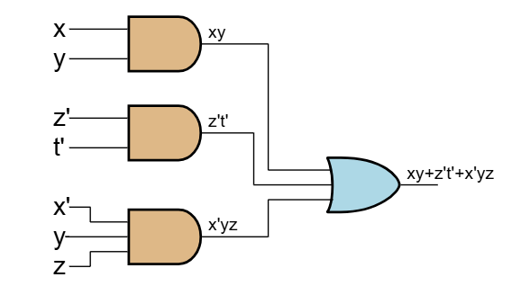

### 1. Побудова карти Карно для 4-х змінних (x, y, z, t):

Карта Карно (xy – рядки, zt – стовпчики):

| zt \ xy | 00 | 01 | 11 | 10 |
|---|---|---|---|---|
| **00** | 0 | 1 | 3 | 2 |
| **01** | 4 | 5 | 7 | 6 |
| **11** | 12 | 13 | 15 | 14 |
| **10** | 8 | 9 | 11 | 10 |

Заповнюємо карту одиницями за заданими конституентами одиниці (0, 4, 5, 7, 12, 14, 15):

| zt \ xy | 00 | 01 | 11 | 10 |
|---|---|---|---|---|
| **00** | 1 | 0 | 0 | 0 |
| **01** | 1 | 1 | 1 | 0 |
| **11** | 1 | 0 | 1 | 1 |
| **10** | 0 | 0 | 0 | 0 |

### 2. Виконуємо склеювання (обираємо контури):

### 3. Записуємо мінімальну ДНФ:

Отже, мінімальна ДНФ (диз'юнктивна нормальна форма):

$\qquad f(x,y,z,t) = xy + \overline{z}\overline{t} + \overline{x} y z$

# Зображення схеми

