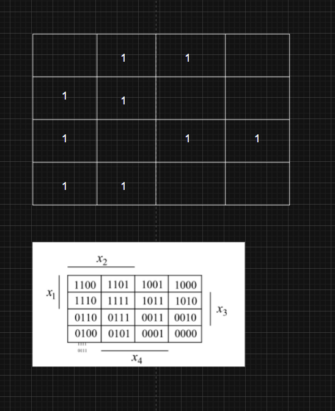

# Лабораторна робота 8. Варіант 5. Завдання 1.

---

### 📌 КРОК 1: Побудувати таблицю істинності

Функція має 4 змінні: `x₁`, `x₂`, `x₃`, `x₄`. Всього 2⁴ = 16 комбінацій.

Позначимо всі входи та знайдемо значення `f` за виразом:

| x₁ | x₂ | x₃ | x₄ | f |
|----|----|----|----|---|
| 0  | 0  | 0  | 0  | 0 |
| 0  | 0  | 0  | 1  | 0 |
| 0  | 0  | 1  | 0  | 1 |
| 0  | 0  | 1  | 1  | 0 |
| 0  | 1  | 0  | 0  | 1 |
| 0  | 1  | 0  | 1  | 1 |
| 0  | 1  | 1  | 0  | 1 |
| 0  | 1  | 1  | 1  | 1 |
| 1  | 0  | 0  | 0  | 0 |
| 1  | 0  | 0  | 1  | 0 |
| 1  | 0  | 1  | 0  | 0 |
| 1  | 0  | 1  | 1  | 1 |
| 1  | 1  | 0  | 0  | 0 |
| 1  | 1  | 0  | 1  | 1 |
| 1  | 1  | 1  | 0  | 1 |
| 1  | 1  | 1  | 1  | 1 |

(Це виписано відповідно до виразу.)

---

### 📌 КРОК 2: Побудувати карту Карно (4 змінні)

Візьмемо:
- по горизонталі: x₃x₄ у коді Грея → `00`, `01`, `11`, `10`
- по вертикалі: x₁x₂ → `00`, `01`, `11`, `10`

Карта Карно виглядатиме так:

```
        x₃x₄ →
x₁x₂ ↓    00  01  11  10
        +---+---+---+---+
     00 | 0 | 0 | 0 | 1 |
     01 | 1 | 1 | 1 | 1 |
     11 | 0 | 1 | 1 | 1 |
     10 | 0 | 0 | 1 | 0 |
```

---

### 📌 КРОК 3: Знайти **групи 1**, щоб покрити всі одиниці **максимально великими блоками 1, 2, 4 або 8**

Вибираємо прямокутники намагаючись покрити їх мінімальною кількістю **максимально великих груп**. Кожна така група → один **кон'юнкт (AND)** у мінімальній ДНФ.

Наприклад:

1. Група (рядок 01, усі стовпці) = `¬x₁ ∧ x₂` (покриває 4 одиниці)
2. Група (рядок 11, стовпці 10,11) = `x₁ ∧ x₂ ∧ x₃` (2 одиниці)
3. Група (рядок 10, стовпець 11) = `x₁ ∧ ¬x₂ ∧ x₃ ∧ x₄` (1 одиниця)
4. Група (рядок 00, стовпець 10) = `¬x₁ ∧ ¬x₂ ∧ x₃ ∧ ¬x₄` (1 одиниця)
6. Також об'єднуємо вертикально.


---

### 📌 КРОК 4: Записати мінімальну ДНФ

```
f(x₁,x₂,x₃,x₄) =
(¬x₁ ∧ x₂) ∨
(x₁ ∧ x₂ ∧ x₃) ∨
(x₁ ∧ ¬x₂ ∧ x₃ ∧ x₄) ∨
(¬x₁ ∧ ¬x₂ ∧ x₃ ∧ ¬x₄)
```

---

# Завдання 2.

Зробимо **повну таблицю істинності для функції**  
\[
f(x_1, x_2, x_3, x_4)
\]
яка задана в **диз'юнктивній нормальній формі**:

\[
f = x₁x₂x₃x₄ + x₁x₂¬x₃x₄ + x₁¬x₂¬x₃x₄ + ¬x₁¬x₂x₃x₄ + ¬x₁x₂¬x₃x₄ + x₁x₂x₃¬x₄ + ¬x₁x₂x₃¬x₄ + ¬x₁x₂¬x₃¬x₄ + ¬x₁¬x₂x₃¬x₄
\]

---

## 📋 Таблиця істинності

| №  | x₁ | x₂ | x₃ | x₄ | f |
|----|----|----|----|----|---|
|  0 |  0 |  0 |  0 |  0 | 0 |
|  1 |  0 |  0 |  0 |  1 | 0 |
|  2 |  0 |  0 |  1 |  0 | 1 |
|  3 |  0 |  0 |  1 |  1 | 1 |
|  4 |  0 |  1 |  0 |  0 | 1 |
|  5 |  0 |  1 |  0 |  1 | 1 |
|  6 |  0 |  1 |  1 |  0 | 1 |
|  7 |  0 |  1 |  1 |  1 | 0 |
|  8 |  1 |  0 |  0 |  0 | 0 |
|  9 |  1 |  0 |  0 |  1 | 1 |
| 10 |  1 |  0 |  1 |  0 | 0 |
| 11 |  1 |  0 |  1 |  1 | 0 |
| 12 |  1 |  1 |  0 |  0 | 0 |
| 13 |  1 |  1 |  0 |  1 | 1 |
| 14 |  1 |  1 |  1 |  0 | 1 |
| 15 |  1 |  1 |  1 |  1 | 1 |

---

### 🧠 Як визначався f?
Я просто **перевіряв, чи вхідна комбінація відповідає одному з термів у ДНФ**.

Наприклад:
- Рядок 3: `0 0 1 1` → це `¬x₁¬x₂x₃x₄` → ✅ входить → `f = 1`
- Рядок 13: `1 1 0 1` → це `x₁x₂¬x₃x₄` → ✅ входить → `f = 1`
- Рядок 11: `1 0 1 1` → ніде немає такого терма → `f = 0`

---


## 🔢 Мінтерми, де \( f = 1 \):

З таблиці істинності:
```
m ∈ {2, 3, 4, 5, 6, 9, 13, 14, 15}
```

---

## 🧩 Діаграма Вейча

Оскільки ми маємо 4 змінні, схема буде **одновимірною з 16 клітинками**, кожна — це **мінтерм** від 0 до 15.

Кожна клітинка — це комбінація змінних у **Gray-коді** (але в спрощеній Вейча-версії ми просто відображаємо мітки від 0 до 15 — як у Карно, просто в рядок):

```
Minterm #:    0  1  2  3  4  5  6  7  8  9 10 11 12 13 14 15
f value:      0  0  1  1  1  1  1  0  0  1  0  0  0  1  1  1
```

🔵 — де \( f = 1 \)

---

## 📌 Візуально як діаграма Вейча:

```
 0   1   2   3   4   5   6   7   8   9  10  11  12  13  14  15
[0] [0] [1] [1] [1] [1] [1] [0] [0] [1] [0] [0] [0] [1] [1] [1]
```

---



***У мене не вийшло розібратися як правильно робити об'єднання одиниць в групи. Також не зовсім впевнений щодо карти Карно з першого завдання.Наразі просто розмістив одиниці взявши за приклад діаграму з теоретичної частини ЛР***


