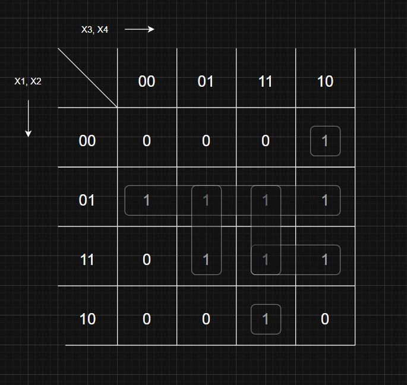

# Лабораторна робота 8. Варіант 5.

---

### 📌 КРОК 1: Побудувати таблицю істинності

Функція має 4 змінні: `x₁`, `x₂`, `x₃`, `x₄`. Всього 2⁴ = 16 комбінацій.

Позначимо всі входи та знайдемо значення `f` за виразом:

| x₁ | x₂ | x₃ | x₄ | f |
|----|----|----|----|---|
| 0  | 0  | 0  | 0  | 0 |
| 0  | 0  | 0  | 1  | 0 |
| 0  | 0  | 1  | 0  | 1 |
| 0  | 0  | 1  | 1  | 0 |
| 0  | 1  | 0  | 0  | 1 |
| 0  | 1  | 0  | 1  | 1 |
| 0  | 1  | 1  | 0  | 1 |
| 0  | 1  | 1  | 1  | 1 |
| 1  | 0  | 0  | 0  | 0 |
| 1  | 0  | 0  | 1  | 0 |
| 1  | 0  | 1  | 0  | 0 |
| 1  | 0  | 1  | 1  | 1 |
| 1  | 1  | 0  | 0  | 0 |
| 1  | 1  | 0  | 1  | 1 |
| 1  | 1  | 1  | 0  | 1 |
| 1  | 1  | 1  | 1  | 1 |

(Це виписано відповідно до виразу.)

---

### 📌 КРОК 2: Побудувати карту Карно (4 змінні)

Візьмемо:
- по горизонталі: x₃x₄ у коді Грея → `00`, `01`, `11`, `10`
- по вертикалі: x₁x₂ → `00`, `01`, `11`, `10`

Карта Карно виглядатиме так:

```
        x₃x₄ →
x₁x₂ ↓    00  01  11  10
        +---+---+---+---+
     00 | 0 | 0 | 0 | 1 |
     01 | 1 | 1 | 1 | 1 |
     11 | 0 | 1 | 1 | 1 |
     10 | 0 | 0 | 1 | 0 |
```

---

### 📌 КРОК 3: Знайти **групи 1**, щоб покрити всі одиниці **максимально великими блоками 1, 2, 4 або 8**

Вибираємо прямокутники намагаючись покрити їх мінімальною кількістю **максимально великих груп**. Кожна така група → один **кон'юнкт (AND)** у мінімальній ДНФ.

Наприклад:

1. Група (рядок 01, усі стовпці) = `¬x₁ ∧ x₂` (покриває 4 одиниці)
2. Група (рядок 11, стовпці 10,11) = `x₁ ∧ x₂ ∧ x₃` (2 одиниці)
3. Група (рядок 10, стовпець 11) = `x₁ ∧ ¬x₂ ∧ x₃ ∧ x₄` (1 одиниця)
4. Група (рядок 00, стовпець 10) = `¬x₁ ∧ ¬x₂ ∧ x₃ ∧ ¬x₄` (1 одиниця)
6. Також об'єднуємо вертикально.




---

### 📌 КРОК 4: Записати мінімальну ДНФ

```
f(x₁,x₂,x₃,x₄) =
(¬x₁ ∧ x₂) ∨
(x₁ ∧ x₂ ∧ x₃) ∨
(x₁ ∧ ¬x₂ ∧ x₃ ∧ x₄) ∨
(¬x₁ ∧ ¬x₂ ∧ x₃ ∧ ¬x₄)
```

---

